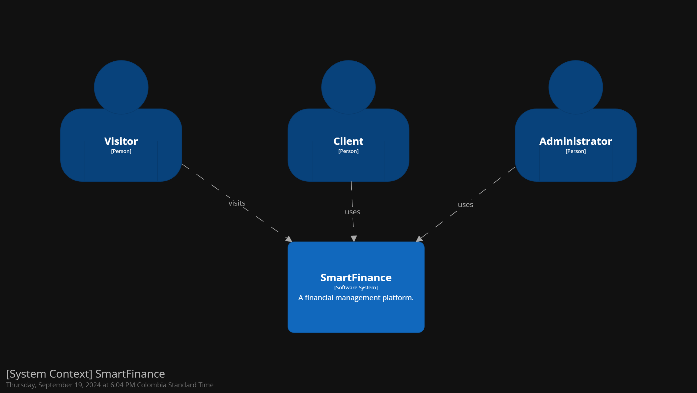
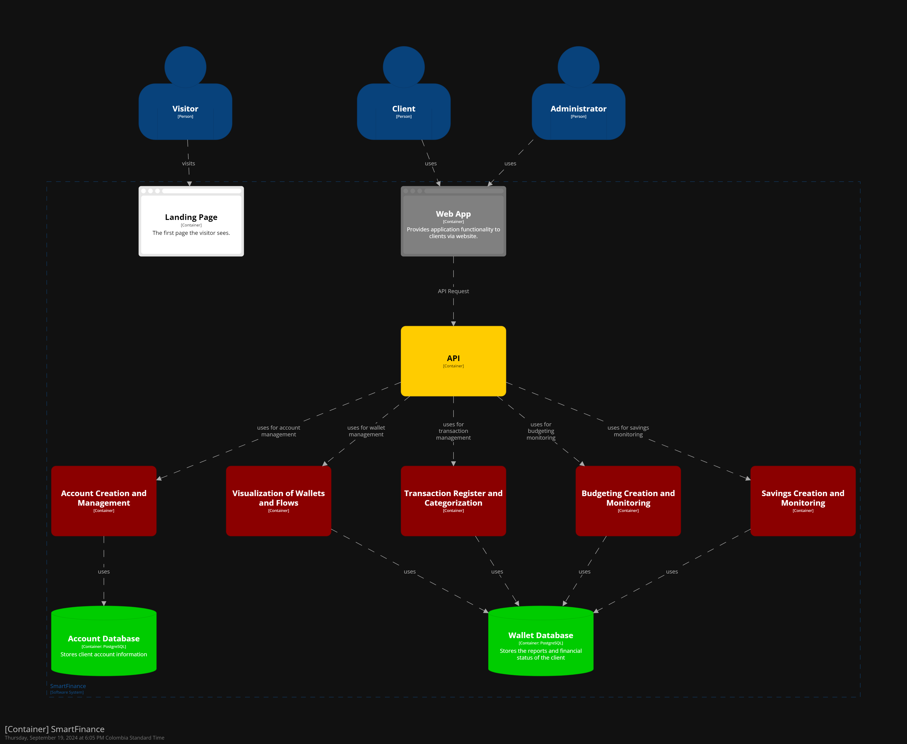
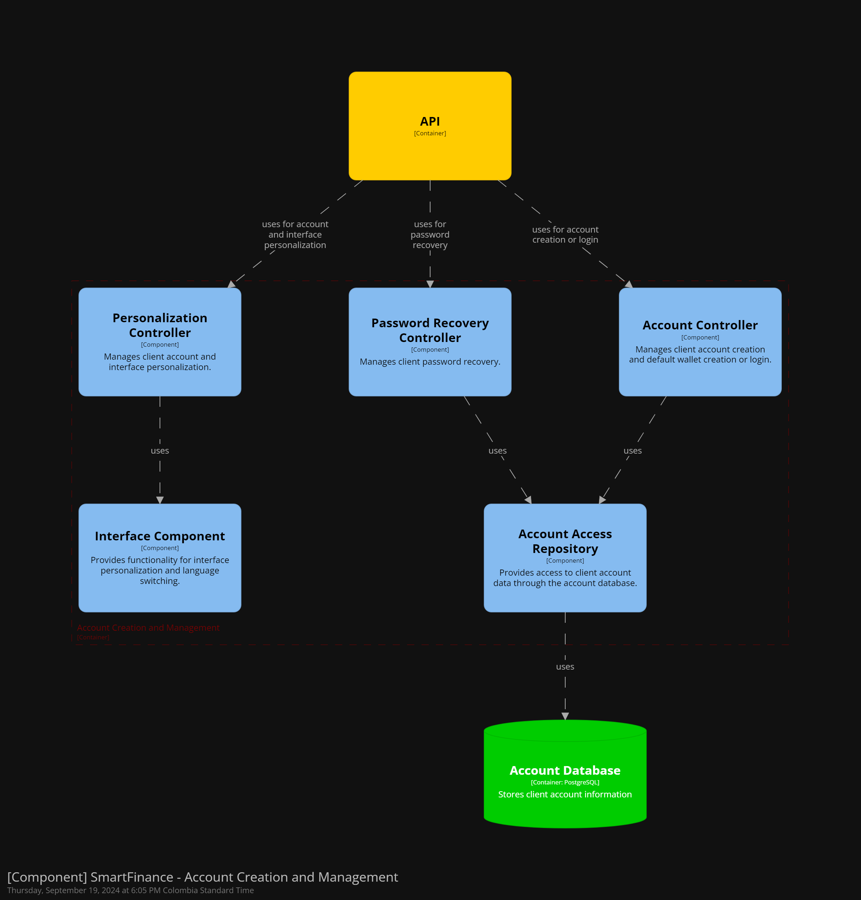
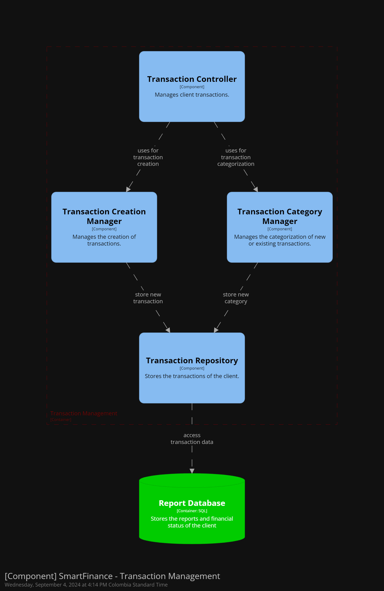
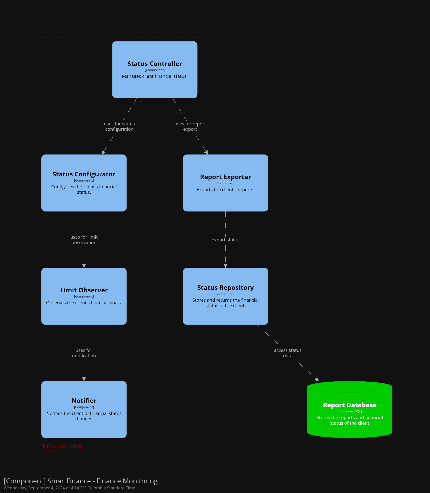
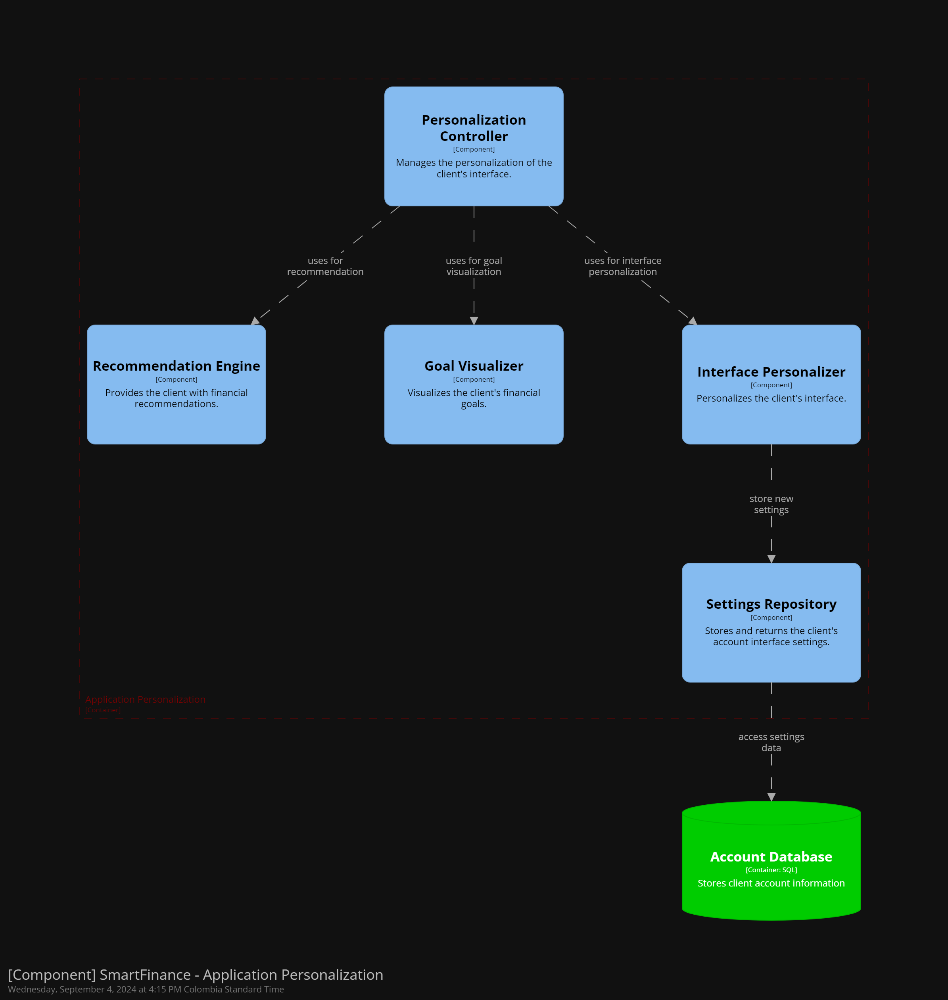

# upc-pre-202401-si729-WS51-SmartFinance-report

## Registro de Versiones del Informe

| Versión | Fecha | Autor | Descripción de modificación |
|---------|-------|-------|-----------------------------|
| TB1     |       |       |                             |

## Project Report Collaboration Insights

## Contenido

- [Student Outcome](#student-outcome)

- [Capítulo I: Introducción](#cap1)
    - [1.1. Startup Profile](#11-startup-profile)
        - [1.1.1. Descripción de la Startup](#111-descripción-de-la-startup)
        - [1.1.2. Perfiles de integrantes del equipo](#112-perfiles-de-integrantes-del-equipo)
    - [1.2. Solution Profile](#12-solution-profile)
        - [1.2.1 Antecedentes y problemática](#121-antecedentes-y-problemática)
        - [1.2.2 Lean UX Process](#122-lean-ux-process)
            - [1.2.2.1. Lean UX Problem Statements](#1221-lean-ux-problem-statements)
            - [1.2.2.2. Lean UX Assumptions](#1222-lean-ux-assumptions)
            - [1.2.2.3. Lean UX Hypothesis Statements](#1223-lean-ux-hypothesis-statements)
            - [1.2.2.4. Lean UX Canvas](#1224-lean-ux-canvas)
    - [1.3. Segmentos objetivo](#13-segmentos-objetivo)

- [Capítulo II: Requirements Elicitation & Analysis](#cap2)
    - [2.1. Competidores](#21-competidores)
        - [2.1.1. Análisis competitivo](#211-análisis-competitivo)
        - [2.1.2. Estrategias y tácticas frente a competidores](#212-estrategias-y-tácticas-frente-a-competidores)
    - [2.2. Entrevistas](#22-entrevistas)
        - [2.2.1. Diseño de entrevistas](#221-diseño-de-entrevistas)
        - [2.2.2. Registro de entrevistas](#222-registro-de-entrevistas)
        - [2.2.3. Análisis de entrevistas](#223-análisis-de-entrevistas)
    - [2.3. Needfinding](#23-needfinding)
        - [2.3.1. User Personas](#231-user-personas)
        - [2.3.2. User Task Matrix](#232-user-task-matrix)
        - [2.3.3. User Journey Mapping](#233-user-journey-mapping)
        - [2.3.4. Empathy Mapping](#234-empathy-mapping)
        - [2.3.5. As-is Scenario Mapping](#235-as-is-scenario-mapping)
    - [2.4. Ubiquitous Language](#24-ubiquitous-language)

- [Capítulo III: Requirements Specification](#cap3)
    - [3.1. To-Be Scenario Mapping](#31-to-be-scenario-mapping)
    - [3.2. User Stories](#32-user-stories)
    - [3.3. Impact Mapping](#33-impact-mapping)
    - [3.4. Product Backlog](#34-product-backlog)

- [Capítulo IV: Product Design](#cap4)
    - [4.1. Style Guidelines](#41-style-guidelines)
        - [4.1.1. General Style Guidelines](#411-general-style-guidelines)
        - [4.1.2. Web Style Guidelines](#412-web-style-guidelines)
    - [4.2. Information Architecture](#42-information-architecture)
        - [4.2.1. Organization Systems](#421-organization-systems)
        - [4.2.2. Labeling Systems](#422-labeling-systems)
        - [4.2.3. SEO Tags and Meta Tags](#423-seo-tags-and-meta-tags)
        - [4.2.4. Searching Systems](#424-searching-systems)
        - [4.2.5. Navigation Systems](#425-navigation-systems)
    - [4.3. Landing Page UI Design](#43-landing-page-ui-design)
        - [4.3.1. Landing Page Wireframe](#431-landing-page-wireframe)
        - [4.3.2. Landing Page Mock-up](#432-landing-page-mock-up)
    - [4.4. Web Applications UX/UI Design](#44-web-applications-uxui-design)
        - [4.4.1. Web Applications Wireframes](#441-web-applications-wireframes)
        - [4.4.2. Web Applications Wireflow Diagrams](#442-web-applications-wireflow-diagrams)
        - [4.4.3. Web Applications Mock-ups](#443-web-applications-mock-ups)
        - [4.4.4. Web Applications User Flow Diagrams](#444-web-applications-user-flow-diagrams)
    - [4.5. Web Applications Prototyping](#45-web-applications-prototyping)
    - [4.6. Domain-Driven Software Architecture](#46-domain-driven-software-architecture)
        - [4.6.1. Software Architecture Context Diagram](#461-software-architecture-context-diagram)
        - [4.6.2. Software Architecture Container Diagrams](#462-software-architecture-container-diagrams)
        - [4.6.3. Software Architecture Components Diagrams](#463-software-architecture-components-diagrams)
    - [4.7. Software Object-Oriented Design](#47-software-object-oriented-design)
        - [4.7.1. Class Diagrams](#471-class-diagrams)
        - [4.7.2. Class Dictionary](#472-class-dictionary)
    - [4.8. Database Design](#48-database-design)
        - [4.8.1. Database Diagram](#481-database-diagram)

- [Capítulo V: Product Implementation, Validation & Deployment](#cap5)
    - [5.1. Software Configuration Management](#51-software-configuration-management)
        - [5.1.1. Software Development Environment Configuration](#511-software-development-environment-configuration)
        - [5.1.2. Source Code Management](#512-source-code-management)
        - [5.1.3. Source Code Style Guide & Conventions](#513-source-code-style-guide--conventions)
        - [5.1.4. Software Deployment Configuration](#514-software-deployment-configuration)
    - [5.2. Landing Page, Services & Applications Implementation](#52-landing-page-services--applications-implementation)
        - [5.2.1. Sprint 1](#521-sprint-1)
            - [5.2.1.1. Sprint Planning 1](#5211-sprint-planning-1)
            - [5.2.1.2. Sprint Backlog 1](#5212-sprint-backlog-1)
            - [5.2.1.3. Development Evidence for Sprint Review](#5213-development-evidence-for-sprint-review)
            - [5.2.1.4. Testing Suite Evidence for Sprint Review](#5214-testing-suite-evidence-for-sprint-review)
            - [5.2.1.5. Execution Evidence for Sprint Review](#5215-execution-evidence-for-sprint-review)
            - [5.2.1.6. Services Documentation Evidence for Sprint Review](#5216-services-documentation-evidence-for-sprint-review)
            - [5.2.1.7. Software Deployment Evidence for Sprint Review](#5217-software-deployment-evidence-for-sprint-review)
            - [5.2.1.8. Team Collaboration Insights during Sprint](#5218-team-collaboration-insights-during-sprint)

- [Conclusiones](#conclusiones)
- [Bibliografía](#bibliografía)
- [Anexos](#anexos)

## Student Outcome

El curso contribuye al cumplimiento del Student Outcome ABET:

**ABET – EAC - Student Outcome 3**

**Criterio:** *Capacidad de comunicarse efectivamente con un rango de audiencias.*
En el siguiente cuadro se describe las acciones realizadas y enunciados de
conclusiones por parte del grupo, que permiten sustentar el haber alcanzado el logro
del ABET – EAC - Student Outcome 3.

<table>
<tr>
    <th>Criterio específico</th>
    <th>Acciones realizadas</th>
    <th>Conclusiones</th>
  </tr>
  <tr>
    <td>Comunica oralmente con
efectividad a diferentes rangos
de audiencia.</td>
    <td>  </td>
    <td> </td>
  </tr>
  <tr>
    <td>Comunica por escrito con
efectividad a diferentes rangos
de audiencia</td>
    <td>  </td>
    <td>  </td>
  </tr>

</table>

## Capítulo I: Introducción 

### 1.1. Startup Profile
#### 1.1.1. Descripción de la Startup

Somos SmartFinance, una startup creada por estudiantes de la carrera de Ingeniería de Software
de la Universidad Peruana de Ciencias Aplicadas del Perú.
Hemos desarrollado una aplicación web llamada Finzar,
diseñada para optimizar la gestión de las finanzas personales de los usuarios.

Finzar es una aplicación web diseñada para transformar la gestión de las finanzas personales
en una experiencia sencilla y efectiva. Con una interfaz intuitiva, permite a los usuarios
controlar sus ingresos y gastos, establecer metas de ahorro, gestionar deudas y recibir reportes
detallados sobre sus hábitos financieros. Finzar también ofrece recordatorios y calculadoras
financieras para facilitar la toma de decisiones informadas, convirtiéndose en un aliado esencial
para quienes buscan mejorar su bienestar económico.

**Misión:** Nuestra misión es proporcionar a las personas una solución fácil de usar para tomar el
control de sus finanzas personales.

**Visión:** En SmartFinance nos visualizamos como un referente
en la creación de soluciones financieras accesibles y prácticas para los peruanos.

#### 1.1.2. Perfiles de integrantes del equipo

<table>
  <tr>
    <th colspan="2"> Foto Intengrante 1 </th>
  </tr>
  <tr>
    <td> 
    Foto Intengrante 1

</td>
    <td> desc </td>
  </tr>
  <tr>
    <th colspan="2"> Intengrante 2 </th>
  </tr>
  <tr>
    <td>Foto Intengrante 2 </td>
    <td> desc </td>
  </tr>
<tr>
    <th colspan="2"> Intengrante 3 </th>
  </tr>
  <tr>
    <td>Foto Intengrante 3 </td>
    <td> desc </td>
  </tr>
<tr>
    <th colspan="2"> Intengrante 4 </th>
  </tr>
  <tr>
    <td>
        Foto Intengrante 4
    </td>
    <td> desc </td>
  </tr>
<tr>
    <th colspan="2"> Intengrante 5 </th>
  </tr>
  <tr>
    <td>Foto Intengrante 5 </td>
    <td> desc </td>
  </tr>
</table>

### 1.2. Solution Profile
#### 1.2.1 Antecedentes y problemática

###### What

- ¿Cuál es el problema?

El problema es que los jóvenes adultos peruanos, especialmente estudiantes universitarios
y jóvenes profesionales, enfrentan dificultades significativas para gestionar sus
finanzas personales debido a ingresos limitados y falta de experiencia. Esto conlleva
a problemas como el sobreendeudamiento y la incapacidad para ahorrar de manera efectiva.
Finzar busca resolver estos problemas proporcionando herramientas prácticas y accesibles
para mejorar la estabilidad económica y fomentar buenos hábitos financieros desde una edad
temprana.

- ¿Cuál es la relación con la persona en cuestión?

La relación con la persona en cuestión es directa, ya que Finzar está diseñada
específicamente para ayudar a jóvenes adultos peruanos a gestionar sus
finanzas personales. La aplicación les proporciona las herramientas necesarias
para controlar sus ingresos y gastos, planificar ahorros y evitar problemas financieros,
mejorando así su estabilidad económica y hábitos financieros.

###### When

- ¿Cuándo sucede el problema?

El problema sucede durante una etapa crucial de la vida de los jóvenes adultos,
entre los 18 y 30 años, cuando están estableciendo sus carreras y asumiendo
nuevas responsabilidades financieras.

- ¿Cuándo utiliza el cliente el producto?

El cliente utiliza Finzar de manera continua para gestionar sus finanzas personales,
especialmente cuando realiza actividades financieras diarias como registrar ingresos y gastos,
planificar ahorros y controlar deudas. También recurren a la aplicación en momentos clave, como
al preparar un presupuesto mensual, al recibir recordatorios de pagos, o al analizar sus hábitos
financieros para tomar decisiones económicas informadas.

###### Where

- ¿Dónde está el cliente cuando usa el producto?

El cliente usa Finzar principalmente en su entorno diario, como en casa,
en la universidad o en el trabajo, donde gestiona sus finanzas personales y
revisa su situación económica. La aplicación web está diseñada para ser accesible
desde cualquier lugar con conexión a internet, permitiendo a los usuarios integrar
la gestión financiera en su rutina diaria, ya sea al registrar gastos, planificar
presupuestos o analizar reportes financieros.

- ¿Dónde surge el problema?

El problema surge en el entorno cotidiano de los jóvenes adultos, como en el hogar,
la universidad o el lugar de trabajo, donde enfrentan dificultades para manejar sus
finanzas personales de manera efectiva.

###### Who

- ¿Quienes se ven involucrados en el problema?

En el problema están involucrados jóvenes adultos peruanos ,
incluyendo estudiantes universitarios y jóvenes profesionales que están
empezando sus carreras.

###### Why

- ¿Cuáles son las causas del problema?

Las causas del problema incluyen la falta de educación financiera adecuada y
herramientas accesibles para jóvenes adultos que están comenzando a manejar sus finanzas.
La combinación de ingresos iniciales limitados, gastos imprevistos y la falta de experiencia
en la planificación financiera contribuye al sobreendeudamiento y la incapacidad para ahorrar.

###### How

- ¿En qué condiciones los clientes usan nuestro producto?

Los clientes usan Finzar en condiciones de acceso regular a internet
desde sus dispositivos personales, como computadoras portátiles, tablets o smartphones.
La aplicación está diseñada para ser utilizada de manera intuitiva y accesible
en cualquier momento del día.

###### How much

En un contexto donde el 32,3% de la población peruana estuvo en riesgo de caer en condición de pobreza en 2022,
según el Instituto Nacional de Estadística e Informática (2023), Finzar ofrece una solución accesible y asequible
para jóvenes adultos que buscan mejorar su estabilidad financiera. La aplicación está diseñada para ayudar a este
segmento vulnerable a gestionar mejor sus recursos y evitar dificultades económicas, ofreciendo una versión gratuita
con funcionalidades esenciales y una suscripción premium a bajo costo, adaptada a las necesidades económicas de
quienes están en riesgo financiero.

#### 1.2.2 Lean UX Process
##### 1.2.2.1. Lean UX Problem Statements
Nuestra aplicación, Finzar, fue diseñada para proporcionar a los usuarios una herramienta integral para organizar sus finanzas personales. Hemos observado que muchos jóvenes peruanos, particularmente aquellos con una edad promedio de 21 años, enfrentan dificultades para gestionar su dinero de manera eficiente. Esta falta de habilidades en la gestión financiera está llevando a problemas como el sobreendeudamiento, la falta de ahorros, y una limitada capacidad para alcanzar sus metas económicas a largo plazo. ¿Cómo podríamos mejorar Finzar para que estos jóvenes puedan manejar mejor sus finanzas, medido a través de un aumento en el ahorro personal, una reducción en la deuda y una mayor satisfacción en la planificación financiera?
##### 1.2.2.2. Lean UX Assumptions
###### **Supuestos del Negocio:**
1. **Creo que mis clientes tienen la necesidad de:** Gestionar mejor sus finanzas personales para lograr estabilidad económica.
2. **Estas necesidades pueden resolverse con:** Una aplicación intuitiva que permita organizar ingresos, gastos, ahorros e inversiones.
3. **Mis clientes iniciales son (o serán):** Jóvenes adultos peruanos, entre 18 y 30 años, interesados en mejorar su salud financiera.
4. **El principal valor que un cliente quiere obtener de mi servicio es:** Control total sobre sus finanzas.  
   **También pueden obtener estos beneficios adicionales:** Ahorro de tiempo, reducción de deudas y planificación de inversiones.
5. **Adquiriré la mayoría de mis clientes a través de:** Marketing digital en redes sociales y colaboraciones con influencers.
6. **Ganaré dinero mediante:** Suscripciones mensuales
7. **Mi principal competencia en el mercado será:** Otras apps de finanzas personales y servicios bancarios tradicionales.  
   **Superaremos a la competencia debido a:** Una experiencia de usuario adaptada al contexto local peruano.
8. **El mayor riesgo de mi producto es:** Falta de adopción por parte de los usuarios.  
   **Lo resolveremos mediante:** Mejora continua del producto basada en el feedback de los usuarios.
9. **Otras suposiciones que, si se demuestran falsas, harán que nuestro negocio fracase:** Los jóvenes peruanos no están dispuestos a pagar por servicios financieros adicionales o no confían en las apps para gestionar sus finanzas.
###### **Supuestos del Cliente:**
1. **¿Quién es el cliente?** Jóvenes adultos peruanos, entre 18 y 30 años.
2. **¿Dónde encaja nuestro producto en su vida?** Como una herramienta esencial para gestionar sus finanzas diariamente.
3. **¿Qué problemas soluciona nuestro producto?** Evita el sobreendeudamiento, facilita el ahorro y mejora la planificación financiera.
4. **¿Cuándo y cómo se utiliza nuestro producto?** Diariamente para seguimiento de gastos e ingresos, y mensualmente para ajustes financieros.
5. **¿Qué características son importantes?** Presupuestos personalizados, alertas de gasto, análisis financiero y una interfaz fácil de usar.
6. **¿Cómo debería verse y comportarse nuestro producto?** Con una interfaz moderna, limpia y fácil de navegar, enfocada en la simplicidad y eficiencia.
##### 1.2.2.3. Lean UX Hypothesis Statements
###### **Hipótesis 1:**
**Creemos que** incorporar una función de alertas personalizadas para gastos excesivos ayudará a los jóvenes adultos peruanos a evitar sobreendeudamiento y a mantener un control más riguroso de sus gastos.  
**Sabremos que esto es cierto cuando veamos** una reducción en la cantidad de gastos excesivos reportados por los usuarios, así como un aumento en el número de usuarios que configuran y utilizan las alertas. Además, esperamos recibir feedback positivo sobre la utilidad y eficacia de esta función en las reseñas de la aplicación.
###### **Hipótesis 2:**
**Creemos que** ofrecer recomendaciones personalizadas basadas en los hábitos de gasto y objetivos financieros de los usuarios mejorará su capacidad para ahorrar y planificar a largo plazo.  
**Sabremos que esto es cierto cuando veamos** un aumento en el monto promedio de ahorro mensual de los usuarios, un incremento en la cantidad de metas financieras alcanzadas y comentarios positivos sobre la relevancia de las recomendaciones recibidas en la aplicación.
###### **Hipótesis 3:**
**Creemos que** simplificar el proceso de creación de presupuestos mediante una interfaz más intuitiva y fácil de usar aumentará la adopción de esta función entre nuestros usuarios jóvenes adultos peruanos.  
**Sabremos que esto es cierto cuando veamos** un incremento en la tasa de usuarios que crean y ajustan presupuestos dentro de la aplicación, junto con una mejora en las calificaciones de usabilidad y facilidad de uso en las reseñas de la aplicación.
##### 1.2.2.4. Lean UX Canvas
### 1.3. Segmentos objetivo

**Segmento objetivo #1: Jóvenes Adultos Peruanos**

Este grupo está compuesto por jóvenes adultos de entre 18 y 30 años, 
que incluyen tanto estudiantes universitarios como jóvenes 
profesionales al inicio de sus carreras. Estos individuos 
enfrentan desafíos significativos en la gestión de sus finanzas 
personales, tales como el sobreendeudamiento y la falta de ahorro. 
La realidad económica de este segmento se caracteriza por ingresos 
iniciales limitados y una alta exposición a gastos imprevistos, 
lo que puede dificultar la creación de un colchón financiero estable.

Características clave de este segmento:

- Enfrentan desafíos en la gestión de sus finanzas debido a ingresos iniciales bajos y gastos imprevistos.
- Buscan herramientas prácticas y accesibles para mejorar su estabilidad económica y evitar el sobreendeudamiento.
- Desean desarrollar buenos hábitos financieros desde una edad temprana para asegurar un futuro económico sólido.
- Valoran soluciones que sean fáciles de usar y que se adapten a su estilo de vida dinámico

## Capítulo II: Requirements Elicitation & Analysis 

### 2.1. Competidores

Considerando los ideales de nuestra empresa y la tecnología que desarrolla, alineados 
con nuestra misión y visión, es importante reconocer la existencia de otras aplicaciones 
y herramientas similares en el mercado. 
A continuación, mencionamos algunas de ellas y cómo se diferencian de nuestra propuesta.

- **Monefy:**

Monefy es la aplicación líder en el sector de finanzas tanto en web como móvil, se trata de una herramienta muy completa que le permite al usuario llevar un registro diario de sus gastos, establecer metas, etc. Todo acompañado de una excelente interfaz y una gran variedad de personalización.

  

- **BlueCoins:** 

BlueCoins es una alternativa mas simple y limpia visualmente que aplicaciones mas predominantes en el sector como Monefy por ejemplo, ayuda a la lectura de gastos con gráficos vistosos que se pueden importar en gran variedad de formatos, se diferencia de sus competidores con su sistema de pago, pues es de pago unico a diferencia de sus rivales que cuentan con sistema de suscripción.

  

- **Wallet by BudgetBakers:**

Wallet es una aplicación global que permite a los usuarios 
planificar sus presupuestos y gestionar sus finanzas personales 
con un enfoque en la personalización y sincronización con cuentas 
bancarias. Ofrece reportes detallados y herramientas avanzadas 
para ayudar a los usuarios a tomar decisiones financieras informadas, 
todo dentro de una plataforma flexible y adaptable.

  

#### 2.1.1. Análisis competitivo
<table border="1" style="text-align: center;">
	<tbody>
		<tr>
			<td colspan="6">Análisis de competidores</td>
		</tr>
		<tr>
			<td colspan="2"></td>
			<td>SmartFinance</td>
			<td>Wallet</td>
			<td>Monefy</td>
			<td>Bluecoins</td>
		</tr>
		<tr>
			<td rowspan="2">Perfil</td>
			<td>Resumen</td>
			<td>Una aplicacion que busca apoyar al usuario en la gestion de sus finanzas, el usuario podra establecer presupuestos personalizados, recibir alertas, etc.</td>
			<td>Se trata de una aplicación de planificación financiera, donde el usuario puede establecer sus objetivos, sus presupuestos y llevar control de los gastos que realizo durante el dia</td>
			<td>Es la aplicación líder en finanzas, Monefy ofrece una interfaz simple pero llena de poderosas herramientas orientadas al control de los gastos diarios y de los objetivos del usuario.</td>
			<td>Es una aplicación sencilla que le permite al usuario llevar seguimiento de sus gastos e ingresos, la informacion recolectada puede ser exportada en diferentes formatos.</td>
		</tr>
		<tr>
			<td>Ventaja competitiva</td>
			<td>Buscamos integrar una gran cantidad de herramientas bajo una misma aplicación, manteniendo una interfaz limpia para facilitar la experiencia al usuario.</td>
			<td>Otra aplicación top en el sector de finanzas personales, orientada sobre todo al ahorro de dinero.</td>
			<td>Líder en el sector de finanzas personales y con una excelente reputacion debido a las multiples herramientas que ofrece
      </td>
			<td>Interfaz amigable y funcionamiento rápido y sencillo, muy amigable con nuevos usuarios. </td>
		</tr>
		<tr>
			<td rowspan="2">Perfil de Marketing</td>
			<td>Mercado objetivo</td>
			<td>Jovenes peruanos, entre los 18 y 30 años.</td>
			<td>Adultos que cuentan con multiples gastos diarios.</td>
			<td>Adultos que ya se encuentran en su vida laboral y buscan ahorrar dinero cada mes.</td>
			<td>Cualquier joven o adulto que desee ordenar sus ingresos mensuales de una manera rápida.</td>
		</tr>
		<tr>
			<td>Estrategias de marketing</td>
			<td>Marketing digital en redes sociales y colaboraciones con influencers.</td>
			<td>Alianza con Google Ads, tanto en Youtube como Chrome.</td>
			<td>Marketing online, tanto en artículos online como video reseñas por parte de influencers.</td>
			<td>Promociones realizadas por influencers en Youtube.</td>
		</tr>
		<tr>
			<td rowspan="3">Perfil de Producto</td>
			<td>Productos y Servicios</td>
			<td>Aplicación con herramientas que permiten registrar ingresos y gastos, planificar ahorros, recibir recordatorios, etc.</td>
			<td>Aplicación móvil y web que cuenta con presupuestos, registro diario de gastos y graficos para seguir nuestro progreso</td>
			<td>Aplicación móvil que invita al usuario a ser transparente con sus gastos diarios y lo alienta a empezar a ahorrar dinero.</td>
			<td>Aplicación móvil facil de usar que permite llevar un seguimiento de los gastos diarios con gran variedad de gráficas y métodos de exportación.</td>
		</tr>
		<tr>
			<td>Precios y Costos</td>
			<td>Modelo de suscripción mensual para acceder a los servicios de coaching y planes alimentarios personalizados.</td>
			<td>Modelo gratuito con suscripción anual.</td>
			<td>Modelo gratuito con suscripción anual.</td>
			<td>Inicio gratuito con la posibilidad de mejorar la cuenta a una cuenta premium permanente.</td>
		</tr>
		<tr>
			<td>Canales de distribución</td>
			<td>Disponible en línea a través de la aplicación web.</td>
			<td>Descargable en Google Play y App Store y la plataforma web.</td>
			<td>Descargable en Google Play y App Store.</td>
			<td>Descargable en Google Play y App Store.</td>
		</tr>
		<tr>
			<td rowspan="4">Análisis SWOT</td>
			<td>Fortalezas</td>
			<td>
                <ul>
                    <li>Orientado a jóvenes peruanos</li>
                    <li>Multiples herramientas incluidas</li>
                    <li>Herramientas gratuitas y otras de pago</li>
                </ul>
            </td>
			<td>
                <ul>
                    <li>Gran cantidad de usuarios</li>
                    <li>Buena variedad de herramientas</li>
                </ul>
            </td>
			<td>
                <ul>
                    <li>Orientado al ahorro de dinero</li>
                    <li>Líder en el sector finanzas con gran cantidad de reseñas positivas</li>
                    <li>Herramientas poderosas e interfaz vistosa</li>
                </ul>
            </td>
			<td>
                <ul>
                    <li>Mejora asequible y de pago único</li>
                    <li>Rápida de usar y facilidad para exportar reportes</li>
                </ul>
            </td>
		</tr>
		<tr>
			<td>Debilidades</td>
			<td>
                <ul>
                    <li>Nuevo competidor</li>
                    <li>Sector con competidores fuertes ya establecidos</li>
                </ul>
            </td>
			<td>
                <ul>
                    <li>Suscripción anual con un precio no muy asequible</li>
                    <li>Requiere de mucha atención por parte del usuario</li>
                </ul>
            </td>
			<td>
                <ul>
                    <li>Version gratuita muy limitada</li>
                </ul>
            </td>
			<td>
                <ul>
                    <li>Es la aplicación con menos base de usuarios</li>
                    <li>Poca variedad de herramientas</li>
                </ul>
            </td>
		</tr>
		<tr>
			<td>Oportunidades</td>
			<td>
                <ul>
                    <li>Sin competidores a nivel nacional</li>
                    <li>Puede resultar muy útil para el sector elegido debido a sus posibilidades economicas</li>
                </ul>
            </td>
			<td>
                <ul>
                    <li>Aplicación en crecimiento</li>
                    <li>Soporte para múltiples monedas</li>
                </ul>
            </td>
			<td>
                <ul>
                    <li>Poderosas herramientas en constante actualización</li>
                    <li>Membresía asequible</li>
                </ul>
            </td>
			<td>
                <ul>
                    <li>Pago único y asequible</li>
                    <li>Excelente interfaz</li>
                </ul>
            </td>
		</tr>
		<tr>
			<td>Amenazas</td>
			<td>
                <ul>
                    <li>Competencia ya establecidos</li>
                    <li>Sector muy competitivo</li>
                </ul>
            </td>
			<td>
                <ul>
                    <li>Poca cantidad de usuarios premium</li>
                    <li>Membresía anual muy alta</li>
                </ul>
            </td>
			<td>
                <ul>
                    <li>Soporte tecnico en ingles</li>
                    <li>Precio inconsistente debido a las diferentes promociones</li>
                </ul>
            </td>
			<td>
                <ul>
                    <li>Se ve opacado por la competencia</li>
                    <li>Escala mas sencilla comparado con sus competidores</li>
                </ul>
            </td>
		</tr>
	</tbody>
</table>
#### 2.1.2. Estrategias y tácticas frente a competidores.
### 2.2. Entrevistas.
#### 2.2.1. Diseño de entrevistas

##### Segmento 1:

###### Preguntas de Información General:

1. ¿Cuál es tu nombre?
2. ¿Cuántos años tienes?
3. ¿En qué distrito vives?
4. ¿A qué te dedicas actualmente? (Estudiante, profesional, etc.)

###### Preguntas sobre Hábitos Financieros:

5. ¿Cómo manejas actualmente tus ingresos y gastos?
6. ¿Cuál es el mayor desafío que enfrentas al gestionar tus finanzas personales?
7. ¿Sueles establecer un presupuesto mensual? Si es así, ¿qué tan a menudo lo sigues?
8. ¿Tienes algún sistema o herramienta que te ayude a planificar tus ahorros?
9. ¿Has solicitado algún tipo de crédito o préstamo? 
10. ¿Qué tan fácil o difícil te resulta hacer un seguimiento de tus deudas?
11. ¿Qué características valorarías más en una aplicación de finanzas personales?

###### Preguntas sobre Tecnología y Comportamiento:

12. ¿Qué tipo de dispositivos sueles usar para gestionar tus finanzas?
13. ¿Qué aplicaciones o plataformas digitales utilizas frecuentemente?
14. ¿Cómo te sientes respecto a la privacidad y seguridad de tus datos financieros al usar aplicaciones? ¿Te preocupa que tus datos puedan ser comprometidos?
15. Si pudieras cambiar algo en la forma en que gestionas tus finanzas, ¿qué sería?
16. ¿Qué tan dispuesto estarías a suscribirte por una aplicación que mejore significativamente tu gestión financiera?
17. ¿Qué te haría dejar de usar una aplicación de finanzas personales?

#### 2.2.2. Registro de entrevistas
#### 2.2.3. Análisis de entrevistas
### 2.3. Needfinding
#### 2.3.1. User Personas

#### 2.3.2. User Task Matrix
######  Jóvenes  Adultos Peruanos
| **Tareas (Tasks)**                                   | **Frecuencia** | **Importancia** |
|------------------------------------------------------|:---------------------------------:|:----------------------:|                                                      
| **Registrar ingresos y gastos**                   | Alta           | Alta            | Alta           | Alta            |
| **Crear y ajustar un presupuesto mensual**        | Media          | Alta            | Alta           | Alta            |
| **Planificar y seguir metas de ahorro**           | Media          | Alta            | Alta           | Alta            |
| **Controlar y pagar deudas**                      | Baja           | Media           | Media          | Alta            |
| **Revisar y analizar reportes financieros**       | Media          | Media           | Alta           | Alta            |
| **Buscar información financiera y educación**     | Alta           | Alta            | Media          | Media           |
| **Evaluar y seleccionar herramientas financieras**| Media          | Media           | Media          | Alta            |
| **Consultar asesoría financiera**                 | Baja           | Baja            | Media          | Media           |

#### 2.3.3. User Journey Mapping

#### 2.3.4. Empathy Mapping

#### 2.3.5. As-is Scenario Mapping

### 2.4. Ubiquitous Language

## Capítulo III: Requirements Specification 

### 3.1. To-Be Scenario Mapping

### 3.2. User Stories
| **Epic / Story ID** | **Título**                        | **Descripción**                                                                                                                               | **Criterios de Aceptación**                                                                                                                                                      | **Relacionado con (Epic ID)** |
|---------------------|-----------------------------------|-----------------------------------------------------------------------------------------------------------------------------------------------|---------------------------------------------------------------------------------------------------------------------------------------------------------------------------------|-------------------------------|
| US-01               | Registro de Usuario               | Como visitante, quiero registrarme en la aplicación para empezar a gestionar mis finanzas personales.                                    | **Given** el visitante está en la página de registro, **when** completa los campos obligatorios y hace clic en "Registrarse", **then** el sistema debe crear una cuenta.            | EP-01                         |
| US-02               | Inicio de Sesión                  | Como usuario, quiero iniciar sesión en la aplicación para acceder a mi cuenta y gestionar mis finanzas.                                        | **Given** el usuario está registrado, **when** ingresa sus credenciales correctas, **then** debe poder acceder a su cuenta.                                                       | EP-01                         |
| US-03               | Recuperación de Contraseña        | Como usuario, quiero recuperar mi contraseña en caso de olvidarla para poder acceder nuevamente a mi cuenta.                                   | **Given** el usuario ha olvidado su contraseña, **when** solicita la recuperación, **then** debe recibir un enlace para restablecerla por correo electrónico.                    | EP-01                         |
| US-04               | Ingreso de Transacciones          | Como usuario, quiero ingresar mis transacciones diarias para llevar un control detallado de mis ingresos y gastos.                             | **Given** el usuario está logueado, **when** ingresa una nueva transacción con todos los detalles requeridos, **then** la transacción debe ser registrada correctamente.         | EP-02                         |
| US-05               | Categorizar Transacciones         | Como usuario, quiero categorizar mis transacciones para entender en qué áreas estoy gastando más dinero.                                       | **Given** el usuario ha ingresado transacciones, **when** asigna categorías a cada transacción, **then** debería poder ver un desglose por categorías en su historial.           | EP-02                         |
| US-06               | Visualización del Estado Financiero | Como usuario, quiero visualizar mi estado financiero en un tablero para entender mi situación económica en tiempo real.                         | **Given** el usuario tiene transacciones registradas, **when** accede al tablero, **then** debe ver un resumen claro de sus ingresos, gastos y saldo actual.                     | EP-03                         |
| US-07               | Configuración de Presupuestos     | Como usuario, quiero establecer un presupuesto mensual para controlar mejor mis gastos.                                                        | **Given** el usuario está logueado, **when** establece un presupuesto para una categoría, **then** el sistema debe notificarle cuando esté cerca de alcanzar el límite.          | EP-03                         |
| US-08               | Alertas de Gastos                 | Como usuario, quiero recibir alertas cuando me acerco al límite de mi presupuesto para evitar sobrepasarlo.                                    | **Given** el usuario ha configurado un presupuesto, **when** sus gastos se acercan al límite, **then** debería recibir una notificación en la aplicación.                        | EP-03                         |
| US-09               | Exportar Reportes                 | Como usuario, quiero exportar mis reportes financieros para poder analizarlos fuera de la aplicación.                                          | **Given** el usuario tiene transacciones registradas, **when** solicita un reporte, **then** debería poder descargarlo en formato PDF o Excel.                                   | EP-03                         |
| US-10               | Recomendaciones Personalizadas    | Como usuario, quiero recibir recomendaciones personalizadas basadas en mis hábitos de gasto para mejorar mi salud financiera.                  | **Given** el usuario tiene un historial de transacciones, **when** revisa las recomendaciones, **then** debe ver sugerencias específicas según su comportamiento.                | EP-04                         |
| US-11               | Visualización de Metas Financieras | Como usuario, quiero poder visualizar mis metas financieras y el progreso hacia ellas para mantenerme motivado.                                 | **Given** el usuario ha configurado metas financieras, **when** accede a la sección de metas, **then** debería ver el progreso y cuánto falta para alcanzarlas.                 | EP-04                         |
| US-12               | Personalización de la Experiencia | Como usuario, quiero poder personalizar la interfaz de la aplicación para que se ajuste a mis preferencias y necesidades.                      | **Given** el usuario está logueado, **when** accede a la configuración, **then** debería poder cambiar temas, organización de elementos y otras opciones de personalización.     | EP-04                         |

### **Epic 01: Gestión de Usuarios**
| **Story ID** | **Título**                 |
|--------------|----------------------------|
| US-01        | Registro de Usuario        |
| US-02        | Inicio de Sesión           |
| US-03        | Recuperación de Contraseña |

### **Epic 02: Registro y Organización de Transacciones**
| **Story ID** | **Título**                        |
|--------------|-----------------------------------|
| US-04        | Ingreso de Transacciones           |
| US-05        | Categorizar Transacciones          |

### **Epic 03: Control y Monitoreo Financiero**
| **Story ID** | **Título**                        |
|--------------|-----------------------------------|
| US-06        | Visualización del Estado Financiero |
| US-07        | Configuración de Presupuestos     |
| US-08        | Alertas de Gastos                 |
| US-09        | Exportar Reportes                 |

### **Epic 04: Personalización y Mejora de la Experiencia**
| **Story ID** | **Título**                        |
|--------------|-----------------------------------|
| US-10        | Recomendaciones Personalizadas    |
| US-11        | Visualización de Metas Financieras |
| US-12        | Personalización de la Experiencia |

### 3.3. Impact Mapping

### 3.4. Product Backlog
| **#Orden** | **User Story Id** | **Título**                        | **Descripción**                                                                                                                               | **Story Points** |
|-------------|-------------------|-----------------------------------|-----------------------------------------------------------------------------------------------------------------------------------------------|------------------|
| 1           | US-01             | Registro de Usuario               | Como visitante, quiero registrarme en la aplicación para empezar a gestionar mis finanzas personales.                                    | 3                |
| 2           | US-02             | Inicio de Sesión                  | Como usuario, quiero iniciar sesión en la aplicación para acceder a mi cuenta y gestionar mis finanzas.                                        | 3                |
| 3           | US-03             | Recuperación de Contraseña        | Como usuario, quiero recuperar mi contraseña en caso de olvidarla para poder acceder nuevamente a mi cuenta.                                   | 3                |
| 4           | US-04             | Ingreso de Transacciones          | Como usuario, quiero ingresar mis transacciones diarias para llevar un control detallado de mis ingresos y gastos.                             | 5                |
| 5           | US-05             | Categorizar Transacciones         | Como usuario, quiero categorizar mis transacciones para entender en qué áreas estoy gastando más dinero.                                       | 5                |
| 6           | US-06             | Visualización del Estado Financiero | Como usuario, quiero visualizar mi estado financiero en un tablero para entender mi situación económica en tiempo real.                         | 8                |
| 7           | US-07             | Configuración de Presupuestos     | Como usuario, quiero establecer un presupuesto mensual para controlar mejor mis gastos.                                                        | 8                |
| 8           | US-08             | Alertas de Gastos                 | Como usuario, quiero recibir alertas cuando me acerco al límite de mi presupuesto para evitar sobrepasarlo.                                    | 8                |
| 9           | US-09             | Exportar Reportes                 | Como usuario, quiero exportar mis reportes financieros para poder analizarlos fuera de la aplicación.                                          | 5                |
| 10          | US-10             | Recomendaciones Personalizadas    | Como usuario, quiero recibir recomendaciones personalizadas basadas en mis hábitos de gasto para mejorar mi salud financiera.                  | 8                |
| 11          | US-11             | Visualización de Metas Financieras | Como usuario, quiero poder visualizar mis metas financieras y el progreso hacia ellas para mantenerme motivado.                                 | 5                |
| 12          | US-12             | Personalización de la Experiencia | Como usuario, quiero poder personalizar la interfaz de la aplicación para que se ajuste a mis preferencias y necesidades.                      | 5                |

## Capítulo IV: Product Design 

### 4.1. Style Guidelines
#### 4.1.1. General Style Guidelines
#### 4.1.2. Web Style Guidelines
### 4.2. Information Architecture
#### 4.2.1. Organization Systems
#### 4.2.2. Labeling Systems
#### 4.2.3. SEO Tags and Meta Tags
#### 4.2.4. Searching Systems
#### 4.2.5. Navigation Systems
### 4.3. Landing Page UI Design
#### 4.3.1. Landing Page Wireframe
#### 4.3.2. Landing Page Mock-up
### 4.4. Web Applications UX/UI Design
#### 4.4.1. Web Applications Wireframes
#### 4.4.2. Web Applications Wireflow Diagrams
#### 4.4.3. Web Applications Mock-ups
#### 4.4.4. Web Applications User Flow Diagrams
### 4.5. Web Applications Prototyping
### 4.6. Domain-Driven Software Architecture
La arquitectura de software orientada al dominio proporciona una imagen de lo que se quiere en la estructura de software de nuestro producto. Tal imagen refleja lo que nosotros, Finzar, planteamos para SmartFinance: identificar las funcionalidades de la solución y cómo se van a estructurar adaptándose a los elementos a usar.
#### 4.6.1. Software Architecture Context Diagram
Los elementos presentes son:

* Visitor (Visitante): Visualiza el landing page.
* Client (Cliente): Accede a la aplicación web.
* Administrator (Administrador): Accede a la aplicación web y supervisa su funcionamiento.
* SmartFinance: Software que los usuarios utilizarán.
* Stripe: Software de pago que SmartFinance utilizará.
 

#### 4.6.2. Software Architecture Container Diagrams
Los elementos presentes son:

* Landing Page: Página que presenta el producto.
* Web App: Frontend donde los usuarios interactúan con la aplicación.
* API: Conexión entre el frontend y backend.
* Bounded Contexts: Las funcionalidades que el sistema proporciona a los usuarios.
* Bases de datos: Almacenará datos como cuentas de usuario, reportes, transacciones, ajustes, etc.
 

#### 4.6.3. Software Architecture Components Diagrams
**Account Management**
Los elementos presentes son:
* Controllers: Controlan un conjunto de funcionalidades.
* Managers: Realizan una secuencia para llevar a cabo una acción.
* Repositories: Permiten el acceso a una base de datos o un servicio externo.

**Transaction Management**
Los elementos presentes son:
* Controller: Controla un conjunto de funcionalidades.
* Managers: Realizan una secuencia para llevar a cabo una acción.
* Repository: Permite el acceso a una base de datos.

**Finance Monitoring**
Los elementos presentes son:
* Controller: Controla un conjunto de funcionalidades.
* Configurator: Permite que el usuario realize una configuración de una funcionalidad.
* Exporter: Permite la exportación de un archivo almacenado en la base de datos.
* Observer: Supervisa una funcionalidad, ejecutando una acción si cumple una condición.
* Notifier: Al ser ejecutado, notifica al usuario.
* Repository: Permite el acceso a una base de datos o un servicio externo.

**Application Personalizer**
Los elementos presentes son:
* Controller: Controla un conjunto de funcionalidades.
* Engine: Mini sistema que retorna resultados después de procesarse.
* Visualizer: Interfaz de una funcionalidad que el usuario puede visualizar
* Personalizer: Funciona como un controller, pero se enfoca en cambiar elementos de la interfaz.
* Repository: Permite el acceso a una base de datos o un servicio externo.

### 4.7. Software Object-Oriented Design
#### 4.7.1. Class Diagrams
#### 4.7.2. Class Dictionary
### 4.8. Database Design
#### 4.8.1. Database Diagram

## Capítulo V: Product Implementation, Validation & Deployment 

### 5.1. Software Configuration Management
#### 5.1.1. Software Development Environment Configuration
#### 5.1.2. Source Code Management
#### 5.1.3. Source Code Style Guide & Conventions
#### 5.1.4. Software Deployment Configuration
### 5.2. Landing Page, Services & Applications Implementation
#### 5.2.1. Sprint 1
##### 5.2.1.1. Sprint Planning 1
##### 5.2.1.2. Sprint Backlog 1
##### 5.2.1.3. Development Evidence for Sprint Review
##### 5.2.1.4. Testing Suite Evidence for Sprint Review
##### 5.2.1.5. Execution Evidence for Sprint Review
##### 5.2.1.6. Services Documentation Evidence for Sprint Review
##### 5.2.1.7. Software Deployment Evidence for Sprint Review
##### 5.2.1.8. Team Collaboration Insights during Sprint

## Conclusiones

## Bibliografía

- INEI [Instituto Nacional de Estadística e Informática]. (2023, 11 mayo). *Pobreza monetaria afectó al 27,5% de la población del país en el año 2022*. Recuperado 23 de agosto de 2024, de [https://m.inei.gob.pe/prensa/noticias/pobreza-monetaria-afecto-al-275-de-la-poblacion-del-pais-en-el-ano-2022-14391/](https://m.inei.gob.pe/prensa/noticias/pobreza-monetaria-afecto-al-275-de-la-poblacion-del-pais-en-el-ano-2022-14391/)

## Anexos
